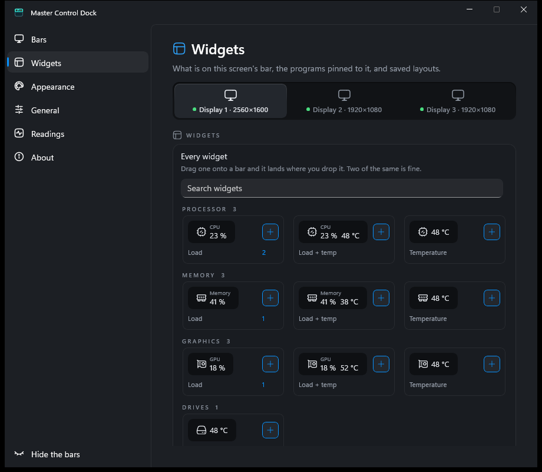
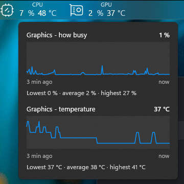

# Master Control Dock

A dock for the edge of your screen: pinned programs and folders, live readings
for CPU, memory, disks and network, and temperatures for the parts of the
machine that will tell you theirs.

It looks and behaves like the Dock in the PowerToys Command Palette, and it
exists because that one has two problems this one is built around.


| Every widget, drawn as it looks on the bar | A press on a reading: its last hour |
|---|---|
|  |  |

## Why this exists

**Widgets go missing on a second monitor.** The PowerToys dock appears on an
additional screen as an empty bar
([microsoft/PowerToys#49604](https://github.com/microsoft/PowerToys/issues/49604),
still open). Their own analysis says why: the per-monitor configuration is filed
under a hardware id, and during a display change that id briefly cannot be read.
The monitor then looks new, and a new secondary monitor is given a configuration
that is disabled with no widgets in it. Because settings are written on every
intermediate reading, that state sticks.

Master Control Dock is built so that this cannot happen:

- A topology reading that has not settled is a *different type* from one that
  has, and only the settled one can be passed to the code that decides what a
  monitor is. Not a rule to remember - the other case does not compile.
- A monitor that matches nothing inherits the primary screen's dock and is
  switched on. The worst outcome of a failed match is a duplicated layout, never
  an empty bar.
- Settings are written only when the set of monitors genuinely changed.
- Entries are never dropped automatically. Forgetting a monitor is a button.
- The listener for display changes lives in the process, not in a dock window,
  so it keeps working when every dock is switched off.

**There is no temperature widget.** Adding one to PowerToys is awkward because
their widgets reuse the Command Palette's command model, which affords an icon,
a title and a subtitle and nothing else. Here a widget brings its own view model
and its own template, so a reading can have a colour that changes at a threshold
and a panel behind it showing every sensor with a minute of history.

## What it can read

Without administrator rights, without a driver, and without any other software:

- CPU, memory, disk and network load
- GPU load, temperature, fan, clocks and power draw on NVIDIA
- NVMe and SATA drive temperatures, including the limits the drive itself declares

Drive temperatures work without administrator rights because of one detail: the
device is opened for *zero* access rather than for reading. The query still
answers, and Windows asks for no privilege. Opening it for `GENERIC_READ`, which
is what full SMART needs, is what would demand elevation.

The processor, the motherboard, its fans, and graphics from AMD and Intel are
**not** available to any program that does not load a kernel driver, and a
Microsoft Store package cannot contain one. Two programs that already have such
a driver will hand their readings over, and Master Control Dock will take them:

**[LibreHardwareMonitor](https://github.com/LibreHardwareMonitor/LibreHardwareMonitor)**
— free, open source, no time limit, and the one to recommend. In it, open
Options and switch on **Remote Web Server → Run**. Then in Master Control Dock,
open the settings, go to **Sensors**, switch **LibreHardwareMonitor** on, and
check the address matches the port it is serving on.

**[HWiNFO](https://www.hwinfo.com/)** — if you already run it:

1. In HWiNFO, open Settings and tick **Shared Memory Support**.
2. In Master Control Dock, open the settings, go to **Sensors** and switch
   **HWiNFO** on.

The processor temperature then appears within half a minute, and the Sensors
page says plainly what is happening if it does not. Graphics and drive
temperatures are still read directly rather than through HWiNFO, one step closer
to the source.

HWiNFO is neither bundled nor installed by this program, and everything above
works without it. Note that the free version publishes its shared memory for
twelve hours at a time and then stops; the dock notices, says so, and picks it
up again when HWiNFO is restarted.

## Installing it

Take **MasterControlDock-<version>-setup.exe** from
[Releases](https://github.com/electronic-mars/MCD/releases/latest). By default it
installs for the current user and needs no administrator rights; it can also
install for all users under Program Files, and asks for rights only then. The program is not
code-signed, so Windows SmartScreen warns once: **More info, Run anyway**. Every
release carries `SHA256SUMS.txt`, and the installer is built in public by
[this workflow](https://github.com/electronic-mars/MCD/actions).

**Updating:** *About, Check for updates*. It fetches the new installer, checks a
signature made with a key that exists only in this repository's secrets (the
program carries the public half), and restarts. An installer the key did not
sign is deleted rather than run. *Update by itself* on the same page does this
once a day: it puts the update in while nobody is at the machine, or, for a copy
under Program Files, shows a notification and asks first. Until that switch is
on, the program contacts nobody on its own.

From source, `pwsh tools/install-local.ps1` builds and installs a copy for
development.

## Using it

Starting it puts a bar on the edge of every screen. **Right-click an empty part
of a bar** for the menu: *Settings*, *Hide the bars*, *Exit*. Starting the
shortcut again while it is running opens the settings too, which is also the
way back in if every bar has been switched off.

There is no icon in the notification area, on purpose: a program whose whole
point is a bar of visible controls should not hide its own behind a chevron in
somebody else's bar.

Four words are used throughout: a **bar** is the strip on a screen's edge, a
**widget** is anything standing on it, a **reading** is a figure from a sensor,
and a **layout** is a saved arrangement of widgets.

The settings window has these pages:

- **Bars** - per screen: whether it has a bar, which edge, how thick, and how
  the bar holds its edge (keeps its place, hides, or lies on the desktop).
- **Widgets** - what is on this screen's bar, in order, with each widget's own
  settings; below it, everything else that can be put there. Drag a widget
  onto the bar and it lands where you drop it; drag one off the edge to remove
  it. Spacers are widgets that stretch: one in the middle splits the bar in
  two, two of them centre what is between.
- **Your programs** - programs, folders and web addresses pinned to the bar. A
  file dropped straight onto the bar is pinned where it lands.
- **Layouts** - saved arrangements. Three come with the program (*Minimal*,
  *Monitoring*, *Work*); keep your own and put any of them on any screen.
- **Appearance** - theme, translucent or solid, size of the readings, colour of
  the readings, and which icon each reading wears.
- **General** - keys, language, start with Windows, and a backup of everything.
  The interface speaks English, Russian, Ukrainian, German, Spanish, French,
  Italian, Portuguese (Brazil), Polish, Czech, Dutch, Turkish, Chinese
  (Simplified), Japanese and Korean, and starts in the one Windows is set to.
  The installer speaks all of them.
- **Sensors** - everything the program reads, where it comes from, and what to
  call it.
- **About** - version, the log, and *Quit*.

Every change is applied as you make it, and **Ctrl+Z** in the settings window
takes the last one back. The bar at the foot of the window's navigation hides
or shows all bars.

To stop it, use *Quit* in the settings, *Exit* in the bar's menu, or
`MasterControlDock.exe --exit`, which asks a running copy to stop and is what
the installer uses. Ending it from Task Manager is safe as well: the bar reserves
its strip of the screen through the shell, and Windows 11 gives the strip back
within a second of the process being gone (checked on build 26200).

## Building

Needs the .NET 10 SDK and the Windows 11 SDK (10.0.26100). No Visual Studio
workload is required.

```
dotnet build
dotnet test tests/MCD.Tests/MCD.Tests.csproj
pwsh tools/smoke.ps1
pwsh tools/smoke.ps1 -Lang ru-RU
```

`tools/smoke.ps1` runs the built program for a few seconds and checks the log
for the markers a healthy start leaves behind. It also makes the settings
window as small as it is allowed to be and measures every page: a paragraph
given less than two hundred points has collapsed, and a word wider than the box
it was drawn in has lost letters off both ends. Run it in more than one language
(`-Lang de-DE`, `-Lang ja-JP`) - a caption that fits its key in English can be
half again as long in German, and the check only ever sees the language it was
run in.

English and Russian are written by hand. The other languages are translated
from the English by free models through NVIDIA NIM with
`tools/translate_strings.py`, which sends only the strings a language is
missing, refuses an answer that loses a placeholder or overruns a label, and
with `--review` has a second model read every language. `docs/manual-checks.md`
lists what has to be checked by hand on a real multi-monitor desk.

## Icons

Hugeicons, free set, MIT. `tools/fetch_icons.py` pulls them through Iconify,
keeps the SVG sources in `assets/icons-src/` and generates the path data the
program draws. Re-run it after changing the list at the top of that file.

## Supporting it

If it is useful to you: [Patreon](https://www.patreon.com/ElectronicMARS).

## Licence

GPL-3.0-or-later. Parts of the dock window and the AppBar handling are adapted
from [PowerToys](https://github.com/microsoft/PowerToys) under the MIT licence;
see `THIRD-PARTY.md` and `docs/upstream.md`. Not affiliated with Microsoft.
